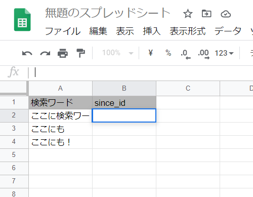

# gas-twitter-search

ツイートの検索結果をSlackに飛ばすbot

## 使い方メモ

1. Slackの[Incoming Webhook URL](https://slack.com/intl/ja-jp/help/articles/115005265063-Slack-%E3%81%A7%E3%81%AE-Incoming-Webhook-%E3%81%AE%E5%88%A9%E7%94%A8)とTwitterの[Bearer Token](https://developer.twitter.com/en)を取得する
2. こんな感じのスプレッドシートを作る (スプレッドシートのIDは`https://docs.google.com/spreadsheets/d/ここの部分/`) 
3. プロジェクトのプロパティを設定する
    | プロパティ名 | 値 |
    | --- | ------- |
    | slackWebhook | SlackのIncoming Webhook URL |
    | twitterToken | TwitterのBearer Token |
4. 実行する関数をmainにして、いい感じにトリガーを設定する
5. おしまい！！！！
